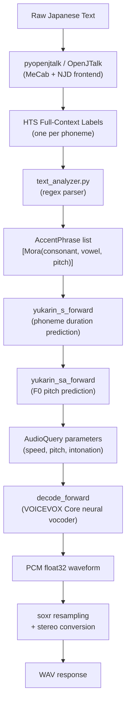

# Technical Challenges of Building a Laravel Version of VOICEVOX Engine

## Executive Summary

The VOICEVOX Engine is a Python/FastAPI HTTP server that acts as a bridge between the VOICEVOX Core neural inference library and end users. Building a native Laravel port requires replicating five major subsystems: a Japanese NLP text analysis pipeline, audio DSP processing, voice morphing, AquesTalk notation parsing, and character/library management. The primary blockers are the **OpenJTalk/MeCab dependency** (no PHP bindings exist) and the **WORLD vocoder** (required for voice morphing). Other subsystems are either already handled by the existing PHP FFI wrapper (`invokable/voicevox-core-php`) or portable to PHP with moderate effort.

The current state of the Engine implementation in this repository is a **single stub controller** for `POST /audio_query` with its logic commented out, and zero tests. The recommended strategy is a hybrid approach: use the PHP FFI wrapper for all neural inference, call OpenJTalk as a subprocess, and delegate voice morphing to the Python engine.

---

## Current State of Engine Implementation

Only one route and one controller stub exist:

| File | Status |
|------|--------|
| `routes/voicevox.php` | 1 route: `POST /audio_query` (stub) |
| `src/Engine/Http/AudioQueryController.php` | Logic commented out, no response |
| Engine tests | None |

The core synthesis call in `AudioQueryController` is commented out with a note: `enable_katakana_english` is an engine-level feature not present in the core library.[^1]

---

## Architecture Overview

The VOICEVOX Engine (Python/FastAPI, v0.24.0) exposes ~41 API operations across 30 paths. Its internal flow for talk synthesis:



For singing synthesis, the flow is different — the Score (list of musical notes with MIDI keys and lyrics) is used directly, bypassing the NLP stage.

---

## Challenge 1: OpenJTalk / pyopenjtalk — The Primary Blocker

**Difficulty: 🔴 Extreme**

### What It Does

Every talk synthesis request starts with `pyopenjtalk`, a Python wrapper around OpenJTalk — a chain of NLP components:

1. **MeCab** — morphological analysis (tokenizes Japanese text, assigns readings and accent types)
2. **NJD** (Naist Japanese Dictionary processing) — post-processes MeCab output into prosody features
3. **Label generation** — produces HTS-style full-context label strings (one per phoneme)

Each label string encodes rich prosodic context: phoneme identity, mora index, accent position, breath group index, interrogative flag, and more.[^2]

The engine calls it in two steps:
```python
njd_features = list(map(lambda f: NjdFeature(**f), pyopenjtalk.run_frontend(text)))
return pyopenjtalk.make_label(list(map(asdict, njd_features)))
```

### Why It's Hard to Port

- **No PHP bindings exist.** A search for PHP bindings to OpenJTalk returned zero results. OpenJTalk is a C++ library with only Python (Cython) bindings.
- **Porting to pure PHP is not feasible.** The MeCab dictionary alone is ~50MB of binary data; the NJD accent sandhi rules are complex and encoded in C++.
- **`pyopenjtalk.make_label()` lives in C++.** It converts `NjdFeature` dicts back into full-context label strings using OpenJTalk's internal `njd2jpcommon` module.

### Viable Strategies

| Approach | Viability |
|----------|-----------|
| Call pyopenjtalk as subprocess | ✅ Best option — call a thin Python wrapper script from PHP |
| PHP FFI binding to OpenJTalk C++ | ⚠️ Theoretically possible but requires writing a C extension |
| Use VOICEVOX Core's built-in OpenJTalk | ✅ PHP FFI wrapper already wraps `OpenJtalk` class |
| Pure PHP port of OpenJTalk | ❌ Infeasible |

**Key insight:** The existing `invokable/voicevox-core-php` FFI wrapper already includes an `OpenJtalk` class that wraps the Core's built-in OpenJTalk instance. However, the Core's OpenJTalk integration doesn't expose intermediate NJD features — it only goes all the way to synthesis. The engine requires the intermediate `AccentPhrase` representation for the query editing APIs (`/accent_phrases`, `/mora_data`, `/mora_length`, `/mora_pitch`).

---

## Challenge 2: `enable_katakana_english` / kanalizer

**Difficulty: 🟡 Medium**

### What It Does

When the `enable_katakana_english` flag is true (default), the engine invokes `kanalizer` to convert unknown English words to katakana pronunciation before MeCab label generation. This is the first blocker identified in `docs/engine.md`.[^3]

`kanalizer` is a **seq2seq neural network** written in **pure Rust** (via `kanalizer-rs`):
- GRU encoder-decoder with multi-head attention
- Input: ASCII characters (28 tokens)
- Output: Katakana tokens (86 tokens)
- Model weights stored as brotli-compressed `safetensors`, embedded in the Rust binary

### The Calling Code

```python
# katakana_english.py
if _is_unknown_reading_word(feature) and is_hankaku_alphabet(string):
    new_pron = convert_english_to_katakana(string)   # calls kanalizer
    njd_features[i] = NjdFeature.from_english_kana(feature.string, new_pron)
```

### Strategies

1. **Call kanalizer as a subprocess** — build the Rust binary (`kanalizer-rs`), call from PHP via `proc_open()`. The binary is standalone and small.
2. **Skip it** — when `enable_katakana_english=false`, kanalizer is never called. Unknown English words fall back to a simple letter-by-letter katakana lookup table (`ojt_alphabet_kana_mapping`). This table is **trivially portable** to a PHP `match` statement.
3. **Port the GRU math to PHP** — possible but expensive (the model is simple GRU + attention, ~400 lines of matrix math).

---

## Challenge 3: Full-Context Label Parsing (text_analyzer)

**Difficulty: 🟢 Low-Medium**

### What It Does

`text_analyzer.py` parses the HTS full-context label strings output by OpenJTalk into a tree of `AccentPhrase → [Mora(consonant+vowel)]` objects.

The entire label is parsed with **one large named-capture regex**:
```python
result = re.search(
    r"^(?P<p1>.+?)\^(?P<p2>.+?)\-(?P<p3>.+?)\+..."
    r"/A\:(?P<a1>.+?)\+(?P<a2>.+?)\+..."
    # ... through /K:
    r"/K\:(?P<k1>.+?)\+(?P<k2>.+?)\-(?P<k3>.+?)$",
    feature,
)
```

Key fields extracted: `phoneme` (p3), `mora_index` (a2), `accent_position` (f2), `is_interrogative` (f3), `accent_phrase_index` (f5), `breath_group_index` (i3).[^4]

### Portability

**High portability.** PHP's PCRE regex supports named captures (`(?P<name>...)`) identically. The grouping algorithm (two-level `groupby` over pause groups then accent phrase groups) translates directly to PHP `array_reduce` + `usort`. The 45-phoneme list and mora mapping table are static arrays.

**Estimated effort:** 2–3 days for faithful PHP translation.

---

## Challenge 4: AudioQuery Construction

**Difficulty: 🟠 Hard (end-to-end)**

The `/audio_query` endpoint combines all three stages above:

1. `pyopenjtalk.run_frontend(text)` + `make_label()` → full-context labels (needs OpenJTalk)
2. `text_analyzer.full_context_labels_to_accent_phrases()` → AccentPhrase list (portable)
3. Core `yukarin_s_forward` + `yukarin_sa_forward` → durations and pitch (PHP FFI covers this)

The `/audio_query_from_preset` variant additionally reads preset YAML and merges its values into the query.

**The bottleneck is always step 1** — you need OpenJTalk. The Core's `createAudioQuery()` C API method does all three steps internally but returns only the final `AudioQuery` JSON, not the intermediate `AccentPhrase` representation needed for query editing endpoints.

---

## Challenge 5: Query Editing Endpoints

**Difficulty: 🟠 Hard**

Four endpoints allow fine-grained adjustment of the generated AudioQuery:

| Endpoint | What It Does |
|----------|-------------|
| `POST /accent_phrases` | Re-runs text analysis from scratch (needs OpenJTalk) |
| `POST /mora_data` | Re-runs both `yukarin_s` and `yukarin_sa` (PHP FFI: `replaceMoraData`) |
| `POST /mora_length` | Re-runs only `yukarin_s` (PHP FFI: `replacePhonemeLength`) |
| `POST /mora_pitch` | Re-runs only `yukarin_sa` (PHP FFI: `replaceMoraPitch`) |

The last three are **directly available via the PHP FFI wrapper** (`replaceMoraData`, `replacePhonemeLength`, `replaceMoraPitch`). Only `/accent_phrases` requires OpenJTalk.

---

## Challenge 6: Voice Morphing (synthesis_morphing / morphable_targets)

**Difficulty: 🔴 Extreme**

### What It Does

Voice morphing blends two separately synthesized voices at the spectral level using the **WORLD vocoder** (`pyworld`):

1. Synthesize both voices at the engine's native sample rate
2. Decompose both with WORLD: F0 (Harvest), spectral envelope (CheapTrick), aperiodicity (D4C)
3. Linearly interpolate spectral envelopes: `morph_spectrogram = base * (1 - rate) + target * rate`
4. Re-synthesize using WORLD with base's F0 and aperiodicity

```python
base_f0, base_time_axis  = pw.harvest(base_wave, fs, frame_period=1.0)
base_spectrogram         = pw.cheaptrick(base_wave, base_f0, base_time_axis, fs)
base_aperiodicity        = pw.d4c(base_wave, base_f0, base_time_axis, fs)
target_spectrogram       = pw.cheaptrick(target_wave, target_f0, morph_time_axis, fs)
morph_spectrogram = base_spectrogram * (1.0 - morph_rate) + target_spectrogram * morph_rate
y_h = pw.synthesize(base_f0, morph_spectrogram, base_aperiodicity, fs, 1.0)
```[^5]

### Why It's Hard to Port

`pyworld` wraps the **WORLD C++ vocoder** (Harvest, CheapTrick, D4C, synthesis algorithms). There is no PHP equivalent. Porting options:

| Approach | Viability |
|----------|-----------|
| Proxy to Python VOICEVOX Engine | ✅ Recommended — just forward the request |
| Call Python WORLD script via exec | ⚠️ Fragile but functional |
| PHP FFI to WORLD C++ library | 🔴 Months of specialized DSP work |
| Pure PHP WORLD implementation | ❌ Infeasible |

The **recommended approach** is to proxy `/synthesis_morphing` and `/morphable_targets` directly to the running VOICEVOX Python Engine, exactly as the existing client already does. The morphability rules (checking `permitted_synthesis_morphing` field: `"ALL"`, `"SELF_ONLY"`, `"NOTHING"`) can be replicated in PHP from character metadata.

**LRU cache note:** The Python engine caches the expensive vocoder decomposition step with `lru_cache(maxsize=4)`. A Laravel implementation proxying to the engine automatically benefits from this.

---

## Challenge 7: Audio Utilities (connect_waves)

**Difficulty: 🟡 Medium**

`POST /connect_waves` accepts a list of base64-encoded WAV strings, resamples all to the highest sample rate using `soxr`, handles mono→stereo upmixing, and concatenates them.

In PHP:
- Base64 decoding is trivial
- WAV header parsing for sample rate detection requires reading 4 bytes at offset 24
- Resampling requires an external tool — **FFmpeg** or **SoX** via `exec()`

**Recommended implementation:** Decode each WAV to a temp file, call `ffmpeg -i ... -filter_complex concat ...`, return the output. No pure PHP audio library is needed.

---

## Challenge 8: AquesTalk Notation Parser (validate_kana)

**Difficulty: 🟡 Medium**

AquesTalk notation (used in `/audio_query_from_kana` and `/validate_kana`) is a phonetic shorthand for Japanese. Examples: `コンニチワ'` (konnichiwa with accent on last mora), `ア'/イウ` (with pause).

The parser (`kana_converter.py`) handles:
- Accent marks (`'`)
- Pause markers (`/`)
- Question marks (sentence-final `?`)
- Full-width katakana mora table
- Error codes: `UNKNOWN_TEXT`, `ACCENT_TOP`, `MISSING_ACCENT`, etc.

**Portability:** High — it's pure string parsing with no NLP dependencies. Can be ported to PHP regex + state machine in ~1 day.

---

## Challenge 9: Character Metadata and Resource Serving

**Difficulty: 🟢 Low-Medium**

The `/speakers`, `/singers`, `/speaker_info`, `/singer_info` endpoints serve character metadata including:
- Policy text (Markdown)
- Portraits and style icons (base64 PNG or URL)
- Voice samples (base64 WAV or URL)

The engine expects a specific **directory structure** under `engine_characters_path/`:
```
{character_uuid}/
    metas.json
    policy.md
    portrait.png
    icons/{style_id}.png
    voice_samples/{style_id}_001.wav  (always exactly 3)
```[^6]

Two resource delivery modes exist:
- `resource_format=base64` — files read and inlined as base64 strings
- `resource_format=url` — files hashed, served at `/_resources/{hash}` with 30-day cache

**For Laravel:** Implement as a simple controller reading from a configurable path. The `resource_format=url` mode maps naturally to Laravel's asset serving.

---

## Challenge 10: Library Management (.vvlib / .vvm)

**Difficulty: 🟡 Medium**

Voice model libraries are distributed as `.vvlib` ZIP archives. On install, the engine:
1. Validates the ZIP and reads `vvlib_manifest.json`
2. Checks engine UUID matches (`c7b58856-bd56-4aa1-afb7-b8415f824b06` for VOICEVOX)
3. Checks version compatibility (`manifest_version <= supported_vvlib_version`)
4. Extracts to `library_root_dir/{library_id}/`

`.vvm` files inside are opened by the VOICEVOX Core C library — **not unzipped by PHP**. The PHP FFI wrapper's `VoiceModelFile::open(string $path)` handles this transparently.[^7]

**For Laravel:** Use PHP's `ZipArchive` for ZIP validation and extraction. The manifest validation is straightforward Pydantic → PHP DTO translation.

---

## Challenge 11: Cancellable Synthesis

**Difficulty: 🟠 Hard (in PHP context)**

The Python engine implements cancellable synthesis using `multiprocessing.Process` — a pool of worker processes. On client disconnect, a background coroutine polls every 1 second and calls `proc.terminate()` (SIGTERM) on the active synthesis process.[^8]

In PHP's traditional request-response model, implementing true mid-synthesis cancellation is difficult. Options:
- **Ignore it** — omit the `/cancellable_synthesis` endpoint (it's a nice-to-have, not core)
- **Use Octane/Swoole** — long-lived PHP worker with coroutine support could replicate the polling approach
- **Proxy to Python engine** — the safest path

---

## Challenge 12: Song Synthesis Pipeline

**Difficulty: 🟡 Medium (compared to Talk)**

The singing synthesis pipeline is actually **easier** than talk synthesis because it bypasses OpenJTalk entirely — the user provides phonemicized lyrics directly.

### Key Differences from Talk

| Dimension | Talk | Song |
|-----------|------|------|
| Input | Raw Japanese text | Score (timed notes with MIDI keys + kana lyrics) |
| NLP required | Yes (OpenJTalk) | No |
| Timing | Neural prediction | User-provided `frame_length` in Score |
| Neural calls | 3 (`yukarin_s`, `yukarin_sa`, `decode_forward`) | 4 (`predict_sing_consonant_length`, `predict_sing_f0`, `predict_sing_volume`, `sf_decode_forward`) |
| CoreStyleType | `"talk"` | `"singing_teacher"` + `"frame_decode"` |

**PHP FFI support:** The PHP FFI wrapper already wraps `createSingFrameAudioQuery()` and `frameSynthesis()`, which cover the main singing pipeline. The consonant-length redistribution algorithm and hiragana→katakana lookup are portable to PHP.[^9]

---

## Challenge 13: Settings and Engine Info

**Difficulty: 🟢 Low**

- `GET /version`, `GET /core_versions`, `GET /engine_manifest` — return static data, trivial
- `GET /setting` — returns an **HTML page** (Jinja2 template for CORS configuration UI), not needed in a PHP library
- `POST /setting` — CORS policy for the engine process itself; not meaningful for a Laravel server

---

## Summary: Difficulty by Component

| Component | Difficulty | Key Blocker | PHP FFI Covers? |
|-----------|-----------|-------------|----------------|
| OpenJTalk text analysis | 🔴 Extreme | No PHP bindings | Partially (full synthesis, not AccentPhrase) |
| `enable_katakana_english` | 🟡 Medium | Rust subprocess needed | No |
| Full-context label parsing | 🟢 Low | Portable regex | N/A |
| AudioQuery construction (end-to-end) | 🟠 Hard | Needs OpenJTalk | Partially |
| Query editing (`/mora_data` etc.) | 🟠 Hard | `/accent_phrases` needs NLP | Yes (3 of 4 endpoints) |
| Voice morphing | 🔴 Extreme | WORLD vocoder | No |
| connect_waves | 🟡 Medium | Needs ffmpeg exec | No |
| AquesTalk parser | 🟡 Medium | Port notation parser | No |
| Character metadata | 🟢 Low | File I/O | No (data from Core metas) |
| Library management | 🟡 Medium | ZIP validation logic | Partially (VoiceModelFile) |
| Cancellable synthesis | 🟠 Hard | No PHP multiprocess | No |
| Song synthesis | 🟡 Medium | Consonant redistribution | Yes (frameSynthesis) |
| Speaker init / info | 🟢 Low | Proxy or FFI | Yes (metas, isLoaded) |
| Settings / engine info | 🟢 Low | Static data | No |

---

## Recommended Implementation Strategy

### Phase 1: Easy Wins (Proxy Pattern)
Route all endpoints to the running Python VOICEVOX Engine via the existing HTTP client. This gives 100% API compatibility immediately, with the PHP layer acting as a routing/middleware layer.

### Phase 2: Native Implementation of FFI-Covered Endpoints
Implement natively (no subprocess):
- `POST /synthesis` — `Synthesizer::synthesis()`
- `POST /mora_data`, `/mora_length`, `/mora_pitch` — `Synthesizer::replaceMoraData()` etc.
- `POST /sing_frame_audio_query`, `/frame_synthesis` — `Synthesizer::createSingFrameAudioQuery()` + `frameSynthesis()`
- `GET /speakers`, `/singer_info`, `/speaker_info` — build from `Synthesizer::metas()`

### Phase 3: Subprocess-Assisted Endpoints
Implement using subprocess calls:
- `POST /audio_query`, `/accent_phrases` — call pyopenjtalk via subprocess
- `POST /audio_query_from_kana` — port `parse_kana()` + use FFI synthesis
- `enable_katakana_english=true` — call kanalizer Rust binary

### Defer or Always Proxy
- `POST /synthesis_morphing` — too dependent on WORLD vocoder
- `POST /cancellable_synthesis` — depends on multiprocessing model
- `POST /connect_waves` — use ffmpeg exec or defer

---

## Key Repository References

| Repository | Purpose |
|-----------|---------|
| [VOICEVOX/voicevox_engine](https://github.com/VOICEVOX/voicevox_engine) | Python engine (submodule at `voicevox_engine/`) |
| [invokable/voicevox-core-php](https://github.com/invokable/voicevox-core-php) | PHP FFI wrapper for VOICEVOX Core C ABI |
| [VOICEVOX/voicevox_vvm](https://github.com/VOICEVOX/voicevox_vvm) | Voice model file (.vvm) distribution |
| [VOICEVOX/kanalizer](https://github.com/VOICEVOX/kanalizer) | English→Katakana seq2seq neural network (Rust) |
| [r9y9/pyopenjtalk](https://github.com/r9y9/pyopenjtalk) | Python wrapper for OpenJTalk |

---

## Confidence Assessment

**High confidence (verified from source):**
- The complete TTS and song synthesis pipeline architectures
- The specific challenge areas (OpenJTalk, pyworld, kanalizer)
- Current implementation state (one stub controller)
- PHP FFI wrapper capabilities (which endpoints are already covered)
- All endpoint specifications and data models

**Medium confidence (inferred from partial reads):**
- The exact kanalizer model size (GRU is small, but exact weight count not confirmed)
- Full details of `pyopenjtalk.make_label()` internals (lives in C++ source)

**Assumptions made:**
- The PHP server will run on Linux/macOS with Python available for subprocess calls
- FFI is enabled in the PHP environment (required for voicevox-core-php)

---

## Footnotes

[^1]: `src/Engine/Http/AudioQueryController.php:14-16` — `// コアにはenable_katakana_englishはないのでコアを使えば簡単にエンジンAPIが作れるわけではない。`
[^2]: `voicevox_engine/voicevox_engine/tts_pipeline/njd_feature_processor.py:89-108`
[^3]: `docs/engine.md` (this repository) — "最初の`/audio_query`からenable_katakana_englishはコアになくエンジンの独自実装"
[^4]: `voicevox_engine/voicevox_engine/tts_pipeline/text_analyzer.py:91-121`
[^5]: `voicevox_engine/voicevox_engine/morphing/morphing.py:116-203`
[^6]: `voicevox_engine/voicevox_engine/metas/metas_store.py:151-170`
[^7]: `invokable/voicevox-core-php:src/VoiceModelFile.php:22-34`
[^8]: `voicevox_engine/voicevox_engine/cancellable_engine.py:159-174`
[^9]: `invokable/voicevox-core-php:src/Synthesizer.php` — `createSingFrameAudioQuery()` and `frameSynthesis()` methods
