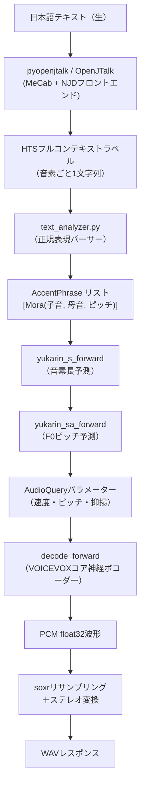

# VOICEVOXエンジンのLaravel版開発における技術的課題

## エグゼクティブサマリー

VOICEVOXエンジンはPython/FastAPIで実装されたHTTPサーバーであり、VOICEVOXコアの神経推論ライブラリとユーザーの間を橋渡しする役割を担っている。Laravel版の開発には、日本語NLPテキスト解析パイプライン、音声DSP処理、ボイスモーフィング、AquesTalk記法パーサー、キャラクター・ライブラリ管理という5つの主要なサブシステムを再実装する必要がある。

最大の障壁は **OpenJTalk/MeCabへの依存**（PHPバインディングが存在しない）と **WORLDボコーダー**（ボイスモーフィングに必要）の2点。それ以外のサブシステムは、既存のPHP FFIラッパー（`invokable/voicevox-core-php`）で対応済みか、中程度の工数でPHPに移植可能。

現時点でのエンジン実装は**スタブコントローラー1つ**（ロジックはコメントアウト）のみで、テストは存在しない。推奨戦略は「ハイブリッドアプローチ」：すべての神経推論にPHP FFIラッパーを使い、OpenJTalkはサブプロセス経由で呼び出し、ボイスモーフィングはPythonエンジンに委譲する。

---

## 現在の実装状況

| ファイル | 状況 |
|------|------|
| `routes/voicevox.php` | ルート1件のみ: `POST /audio_query`（スタブ） |
| `src/Engine/Http/AudioQueryController.php` | ロジックはコメントアウト、レスポンスなし |
| エンジンテスト | ゼロ |

`AudioQueryController`のコアの合成呼び出しはコメントアウトされており、理由が記されている：`enable_katakana_english`はコアライブラリに存在しないエンジン独自の機能であるため、コアをそのまま使っただけでは実装できない。[^1]

---

## アーキテクチャ概要

VOICEVOXエンジン（Python/FastAPI、v0.24.0）は30のパスに約41のAPIオペレーションを持つ。トーク合成の内部フロー:



歌声合成のフローはトークとは異なる——Score（MIDIキーと読み仮名を持つ音符リスト）を直接使用し、NLPステージを完全にスキップする。

---

## 課題1: OpenJTalk / pyopenjtalk — 最大の障壁

**難易度: 🔴 最難関**

### 何をしているか

すべてのトーク合成リクエストは`pyopenjtalk`から始まる。これはOpenJTalkのPythonラッパーで、複数のNLPコンポーネントの連鎖である:

1. **MeCab** — 形態素解析（日本語テキストをトークン化し、読みとアクセント型を付与）
2. **NJD**（奈良先端大学日本語辞書処理）— MeCabの出力を韻律特徴に変換
3. **ラベル生成** — HTS形式のフルコンテキストラベル文字列を生成（音素ごと1行）

各ラベル文字列には豊富な韻律情報が符号化されている：音素種別、モーラインデックス、アクセント位置、呼気段インデックス、疑問文フラグなど。[^2]

エンジンは2ステップでこれを呼び出す:
```python
njd_features = list(map(lambda f: NjdFeature(**f), pyopenjtalk.run_frontend(text)))
return pyopenjtalk.make_label(list(map(asdict, njd_features)))
```

### なぜ難しいか

- **PHPバインディングが存在しない。** OpenJTalkのPHPバインディングは検索しても見つからない。OpenJTalkはC++ライブラリで、Pythonバインディング（Cython製）しかない。
- **純粋なPHPへの移植は事実上不可能。** MeCab辞書だけで約50MBのバイナリデータがあり、NJDのアクセント連濁規則はC++で実装されている。
- **`pyopenjtalk.make_label()`はC++内部に存在する。** NjdFeatureのdictをフルコンテキストラベル文字列に変換するロジックは、OpenJTalkの内部モジュール`njd2jpcommon`にある。

### 現実的な実装戦略

| アプローチ | 実現性 |
|-----------|--------|
| サブプロセス経由でpyopenjtalkを呼ぶ | ✅ 最善策——薄いPythonラッパースクリプトをPHPから`proc_open()`で呼び出す |
| PHPからOpenJTalk C++をFFI | ⚠️ 理論上は可能だがCエクステンション作成が必要 |
| VOICEVOXコア内蔵のOpenJTalkを使う | ✅ PHP FFIラッパーはすでに`OpenJtalk`クラスを持つ |
| OpenJTalkを純PHPで移植 | ❌ 不可能 |

**重要ポイント:** 既存の`invokable/voicevox-core-php` FFIラッパーには`OpenJtalk`クラスがある。ただしコアのOpenJTalk統合はNJD中間特徴を公開せず、合成まで一気通貫で行う。クエリ編集API（`/accent_phrases`、`/mora_data`等）が必要とする中間的な`AccentPhrase`表現を得るには、独立したOpenJTalkプロセスが必要。

---

## 課題2: `enable_katakana_english` / kanalizer

**難易度: 🟡 中程度**

### 何をしているか

`enable_katakana_english`フラグがtrue（デフォルト）の場合、エンジンはMeCabラベル生成前に`kanalizer`を呼んで英語の未知語をカタカナ読みに変換する。これが`docs/engine.md`で最初のブロッカーとして指摘されている内容だ。[^3]

`kanalizer`は**純Rust製のSeq2Seqニューラルネットワーク**（`kanalizer-rs`）:
- 双方向GRUエンコーダー＋GRUデコーダー＋マルチヘッドアテンション
- 入力: ASCIIキャラクター（28トークン）
- 出力: カタカナトークン（86トークン）
- モデル重みはブロトリ圧縮された`safetensors`としてRustバイナリに組み込まれている

### 呼び出しコード

```python
# katakana_english.py
if _is_unknown_reading_word(feature) and is_hankaku_alphabet(string):
    new_pron = convert_english_to_katakana(string)   # kanalizerを呼ぶ
    njd_features[i] = NjdFeature.from_english_kana(feature.string, new_pron)
```

### 実装戦略

1. **kanalizerをサブプロセスとして呼び出す** — Rustバイナリをビルドして`proc_open()`から呼ぶ。バイナリはスタンドアロンで小さい。
2. **スキップする** — `enable_katakana_english=false`のときkanalizerは呼ばれない。英語未知語は単純な文字ごとのカタカナ変換テーブル（`ojt_alphabet_kana_mapping`）にフォールバックする。このテーブルはPHPの`match`文として**そのまま移植可能**。
3. **GRU数学演算をPHPに移植** — 可能だが工数大（GRU＋アテンション、約400行の行列演算）。

---

## 課題3: フルコンテキストラベルパーサー（text_analyzer）

**難易度: 🟢 低〜中程度**

### 何をしているか

`text_analyzer.py`はOpenJTalkが出力したHTSフルコンテキストラベル文字列を、`AccentPhrase → [Mora(子音+母音)]`ツリー構造にパースする。

ラベル全体は**1つの大きな名前付きキャプチャ正規表現**でパースされる:
```python
result = re.search(
    r"^(?P<p1>.+?)\^(?P<p2>.+?)\-(?P<p3>.+?)\+..."
    r"/A\:(?P<a1>.+?)\+(?P<a2>.+?)\+..."
    # ... /K:まで続く
    r"/K\:(?P<k1>.+?)\+(?P<k2>.+?)\-(?P<k3>.+?)$",
    feature,
)
```

抽出されるフィールド: `phoneme`（p3）、`mora_index`（a2）、`accent_position`（f2）、`is_interrogative`（f3）、`accent_phrase_index`（f5）、`breath_group_index`（i3）。[^4]

### 移植性

**移植性は高い。** PHPのPCRE正規表現は名前付きキャプチャ（`(?P<name>...)`）を同一構文でサポートする。グルーピングアルゴリズム（ポーズグループ→アクセント句グループの二段階`groupby`）は`array_reduce`と`usort`に直接変換できる。45音素リストとモーラマッピングテーブルは静的配列。

**推定工数:** 正確なPHP移植で2〜3日。

---

## 課題4: AudioQuery構築（/audio_query）

**難易度: 🟠 難しい（エンドツーエンド）**

`/audio_query`エンドポイントは上記3つのステージをすべて組み合わせる:

1. `pyopenjtalk.run_frontend(text)` + `make_label()` → フルコンテキストラベル（OpenJTalkが必要）
2. `text_analyzer.full_context_labels_to_accent_phrases()` → AccentPhrase リスト（移植可能）
3. コアの`yukarin_s_forward` + `yukarin_sa_forward` → 音素長とピッチ（PHP FFIが対応）

**ボトルネックは常にステップ1** — OpenJTalkが必要。コアの`createAudioQuery()` C APIメソッドは3ステップを内部で全て行うが、クエリ編集エンドポイントに必要な中間的な`AccentPhrase`表現ではなく最終的な`AudioQuery` JSONのみを返す。

---

## 課題5: クエリ編集エンドポイント

**難易度: 🟠 難しい**

4つのエンドポイントが生成されたAudioQueryのきめ細かな調整を可能にする:

| エンドポイント | 処理内容 |
|--------------|---------|
| `POST /accent_phrases` | テキスト解析をゼロから再実行（OpenJTalkが必要） |
| `POST /mora_data` | `yukarin_s`と`yukarin_sa`の両方を再実行（PHP FFI: `replaceMoraData`） |
| `POST /mora_length` | `yukarin_s`のみ再実行（PHP FFI: `replacePhonemeLength`） |
| `POST /mora_pitch` | `yukarin_sa`のみ再実行（PHP FFI: `replaceMoraPitch`） |

後者3つは**PHP FFIラッパーで直接利用可能**（`replaceMoraData`、`replacePhonemeLength`、`replaceMoraPitch`）。`/accent_phrases`のみOpenJTalkが必要。

---

## 課題6: ボイスモーフィング（synthesis_morphing / morphable_targets）

**難易度: 🔴 最難関**

### 何をしているか

ボイスモーフィングは**WORLDボコーダー**（`pyworld`）を使って2つの音声をスペクトル領域でブレンドする:

1. 両ボイスをエンジンのネイティブサンプルレートで別々に合成
2. WORLDで分解: F0（Harvest）、スペクトル包絡（CheapTrick）、非周期性（D4C）
3. スペクトル包絡を線形補間: `morph_spectrogram = base * (1 - rate) + target * rate`
4. ベースのF0と非周期性を使ってWORLDで再合成

```python
base_f0, base_time_axis  = pw.harvest(base_wave, fs, frame_period=1.0)
base_spectrogram         = pw.cheaptrick(base_wave, base_f0, base_time_axis, fs)
base_aperiodicity        = pw.d4c(base_wave, base_f0, base_time_axis, fs)
target_spectrogram       = pw.cheaptrick(target_wave, target_f0, morph_time_axis, fs)
morph_spectrogram = base_spectrogram * (1.0 - morph_rate) + target_spectrogram * morph_rate
y_h = pw.synthesize(base_f0, morph_spectrogram, base_aperiodicity, fs, 1.0)
```
[^5]

### なぜ移植が難しいか

`pyworld`は**WORLD C++ボコーダー**（Harvest、CheapTrick、D4C、synthesis各アルゴリズム）のラッパー。PHP等価物は存在しない。

| アプローチ | 実現性 |
|-----------|--------|
| PythonのVOICEVOXエンジンにプロキシ | ✅ 推奨——リクエストをそのままフォワード |
| Pythonスクリプトをexecで呼び出す | ⚠️ 不安定だが機能はする |
| PHP FFIでWORLD C++ライブラリをバインド | 🔴 専門的なDSP作業で数ヶ月 |
| 純PHPでWORLDを実装 | ❌ 不可能 |

**推奨:** `/synthesis_morphing`と`/morphable_targets`は既存のHTTPクライアントと同様に、動作中のPython VOICEVOXエンジンに直接プロキシする。モーフィング可否ルール（`permitted_synthesis_morphing`フィールド: `"ALL"`、`"SELF_ONLY"`、`"NOTHING"`）はキャラクターメタデータからPHPで再実装できる。

**LRUキャッシュ補足:** PythonエンジンはWORLDボコーダー分解のコスト高いステップを`lru_cache(maxsize=4)`でキャッシュしている。プロキシ実装であれば自動的にこの恩恵を受けられる。

---

## 課題7: 音声ユーティリティ（connect_waves）

**難易度: 🟡 中程度**

`POST /connect_waves`はBase64エンコードされたWAV文字列のリストを受け取り、全てを最高サンプルレートに`soxr`でリサンプリングして連結する。

PHPでは:
- Base64デコードは自明
- サンプルレート検出にWAVヘッダーパース（オフセット24の4バイト）が必要
- リサンプリングに外部ツールが必要——**FFmpeg**または**SoX**の`exec()`経由

**推奨実装:** 各WAVをテンポラリファイルにデコードして`ffmpeg -filter_complex concat`を呼び出す。純PHPのオーディオライブラリは不要。

---

## 課題8: AquesTalk記法パーサー（validate_kana）

**難易度: 🟡 中程度**

AquesTalk記法（`/audio_query_from_kana`と`/validate_kana`で使用）は日本語の音声略記法。例: `コンニチワ'`（最終モーラにアクセント）、`ア'/イウ`（ポーズあり）。

パーサー（`kana_converter.py`）が処理するもの:
- アクセント記号（`'`）
- ポーズマーカー（`/`）
- 疑問符（文末`?`）
- 全角カタカナのモーラテーブル
- エラーコード: `UNKNOWN_TEXT`、`ACCENT_TOP`、`MISSING_ACCENT`等

**移植性:** 高い——NLP依存なしの純粋な文字列パース。PHP正規表現＋ステートマシンで約1日で移植可能。

---

## 課題9: キャラクターメタデータとリソース配信

**難易度: 🟢 低〜中程度**

`/speakers`、`/singers`、`/speaker_info`、`/singer_info`エンドポイントはキャラクターメタデータ（ポリシーテキスト、立ち絵・アイコン、ボイスサンプル）を配信する。

エンジンは`engine_characters_path/`以下に特定の**ディレクトリ構造**を期待する:
```
{character_uuid}/
    metas.json
    policy.md
    portrait.png
    icons/{style_id}.png
    voice_samples/{style_id}_001.wav  （常に3ファイル）
```
[^6]

リソース配信モード:
- `resource_format=base64` — ファイルを読んでBase64文字列にインライン化
- `resource_format=url` — ファイルをハッシュして`/_resources/{hash}`のURLを返す（30日キャッシュ）

**Laravel向け:** 設定可能なパスからファイルを読み込むシンプルなコントローラーとして実装。`resource_format=url`モードはLaravelのアセット配信に自然にマッピングできる。

---

## 課題10: ライブラリ管理（.vvlib / .vvm）

**難易度: 🟡 中程度**

音声モデルライブラリは`.vvlib`形式のZIPアーカイブとして配布される。インストール時にエンジンが行う処理:
1. ZIPを検証して`vvlib_manifest.json`を読む
2. エンジンUUIDが一致するか確認（VOICEVOXは`c7b58856-bd56-4aa1-afb7-b8415f824b06`）
3. バージョン互換性の確認（`manifest_version <= supported_vvlib_version`）
4. `library_root_dir/{library_id}/`に展開

内部の`.vvm`ファイルはVOICEVOXコアCライブラリが開く——**PHPが直接ZIPを展開するわけではない**。PHP FFIラッパーの`VoiceModelFile::open(string $path)`がこれを透過的に処理する。[^7]

**Laravel向け:** ZIPの検証と展開にPHPの`ZipArchive`を使用。マニフェスト検証は直接PHPのDTOに変換できる。

---

## 課題11: キャンセル可能な合成

**難易度: 🟠 難しい（PHPコンテキストでは）**

Pythonエンジンは`multiprocessing.Process`——ワーカープロセスのプール——を使ってキャンセル可能な合成を実装している。クライアントが切断すると、バックグラウンドのコルーチンが1秒おきにポーリングして、アクティブな合成プロセスに`proc.terminate()`（SIGTERM）を送る。[^8]

PHP従来のリクエスト・レスポンスモデルでは、合成途中の真のキャンセレーションは難しい。選択肢:
- **無視する** — `/cancellable_synthesis`エンドポイントを省略（必須ではなくnice-to-have）
- **Octane/Swoole使用** — 長命なPHPワーカーとコルーチンサポートでポーリング手法を再現
- **Pythonエンジンにプロキシ** — 最も安全な方法

---

## 課題12: 歌声合成パイプライン（ソングエンジン）

**難易度: 🟡 中程度（トーク合成との比較で）**

歌声合成パイプラインはOpenJTalkを完全にスキップするため、トーク合成より**実は実装しやすい**。ユーザーが読み仮名を直接指定するから。

### トーク合成との主な違い

| 次元 | トーク | ソング |
|------|-------|--------|
| 入力 | 生の日本語テキスト | Score（MIDIキーと読み仮名を持つ音符リスト） |
| NLP必要 | はい（OpenJTalk） | いいえ |
| タイミング | 神経モデルが予測 | ScoreのNote.frame_lengthでユーザーが指定 |
| 神経モデル呼び出し数 | 3回（yukarin_s、yukarin_sa、decode_forward） | 4回（predict_sing_consonant_length、predict_sing_f0、predict_sing_volume、sf_decode_forward） |
| CoreStyleType | `"talk"` | `"singing_teacher"` + `"frame_decode"` |

**PHP FFIサポート:** PHP FFIラッパーはすでに`createSingFrameAudioQuery()`と`frameSynthesis()`をラップしており、メインの歌声パイプラインをカバーしている。子音長再分配アルゴリズムとひらがな→カタカナ変換はPHPに移植できる。[^9]

---

## 課題13: 設定とエンジン情報

**難易度: 🟢 低**

- `GET /version`、`GET /core_versions`、`GET /engine_manifest` — 静的データを返す、自明
- `GET /setting` — **HTMLページ**（CORS設定UIのJinja2テンプレート）、PHPライブラリには不要
- `POST /setting` — エンジンプロセス自身のCORS設定；Laravelサーバーには意味がない

---

## コンポーネント別難易度まとめ

| コンポーネント | 難易度 | 主なブロッカー | PHP FFIで対応済み? |
|--------------|--------|--------------|------------------|
| OpenJTalkテキスト解析 | 🔴 最難関 | PHPバインディングなし | 部分的（完全合成のみ、AccentPhraseは不可） |
| `enable_katakana_english` | 🟡 中 | Rustサブプロセスが必要 | いいえ |
| フルコンテキストラベルパース | 🟢 低 | 正規表現で移植可能 | 該当なし |
| AudioQuery構築（E2E） | 🟠 難 | OpenJTalkが必要 | 部分的 |
| クエリ編集（/mora_data等） | 🟠 難 | /accent_phrasesのみNLP依存 | はい（4つ中3つ） |
| ボイスモーフィング | 🔴 最難関 | WORLDボコーダー | いいえ |
| connect_waves | 🟡 中 | ffmpegのexecが必要 | いいえ |
| AquesTalkパーサー | 🟡 中 | 記法パーサーの移植 | いいえ |
| キャラクターメタデータ | 🟢 低 | ファイルI/O | いいえ（Coreのmetasからデータ取得） |
| ライブラリ管理 | 🟡 中 | ZIP検証ロジック | 部分的（VoiceModelFile） |
| キャンセル可能な合成 | 🟠 難 | PHPのマルチプロセスなし | いいえ |
| ソング合成 | 🟡 中 | 子音長再分配 | はい（frameSynthesis） |
| スピーカー初期化・情報 | 🟢 低 | プロキシかFFI | はい（metas、isLoaded） |
| 設定・エンジン情報 | 🟢 低 | 静的データ | いいえ |

---

## 推奨実装戦略

### フェーズ1: 簡単に実現できるもの（プロキシパターン）
動作中のPython VOICEVOXエンジンへすべてのエンドポイントをルーティングする。PHPレイヤーはルーティング・ミドルウェア層として機能し、即座に100% API互換性を実現する。

### フェーズ2: FFI対応エンドポイントのネイティブ実装
サブプロセス不要でネイティブ実装:
- `POST /synthesis` — `Synthesizer::synthesis()`
- `POST /mora_data`、`/mora_length`、`/mora_pitch` — `Synthesizer::replaceMoraData()`等
- `POST /sing_frame_audio_query`、`/frame_synthesis` — `Synthesizer::createSingFrameAudioQuery()` + `frameSynthesis()`
- `GET /speakers`、`/singer_info`、`/speaker_info` — `Synthesizer::metas()`から構築

### フェーズ3: サブプロセス支援エンドポイント
サブプロセス呼び出しを使った実装:
- `POST /audio_query`、`/accent_phrases` — pyopenjtalkをサブプロセスで呼ぶ
- `POST /audio_query_from_kana` — `parse_kana()`を移植 + FFIで合成
- `enable_katakana_english=true` — kanalizerのRustバイナリを呼ぶ

### 常にプロキシまたは後回し
- `POST /synthesis_morphing` — WORLDボコーダーへの依存が大きすぎる
- `POST /cancellable_synthesis` — マルチプロセシングモデルに依存
- `POST /connect_waves` — ffmpeg execを使うか後回し

---

## 主要リポジトリ一覧

| リポジトリ | 用途 |
|----------|------|
| [VOICEVOX/voicevox_engine](https://github.com/VOICEVOX/voicevox_engine) | Pythonエンジン（本リポジトリのサブモジュール） |
| [invokable/voicevox-core-php](https://github.com/invokable/voicevox-core-php) | VOICEVOX Core C ABIのPHP FFIラッパー |
| [VOICEVOX/voicevox_vvm](https://github.com/VOICEVOX/voicevox_vvm) | 音声モデルファイル（.vvm）配布リポジトリ |
| [VOICEVOX/kanalizer](https://github.com/VOICEVOX/kanalizer) | 英語→カタカナのSeq2Seqニューラルネット（Rust製） |
| [r9y9/pyopenjtalk](https://github.com/r9y9/pyopenjtalk) | OpenJTalkのPythonラッパー |

---

## 信頼度評価

**高信頼度（ソースコードで検証済み）:**
- トークおよびソング合成パイプラインの完全なアーキテクチャ
- 課題の具体的な内容（OpenJTalk、pyworld、kanalizer）
- 現在の実装状態（スタブコントローラー1つのみ）
- PHP FFIラッパーの機能（どのエンドポイントが対応済みか）
- 全エンドポイントの仕様とデータモデル

**中程度の信頼度（部分的な読み取りから推論）:**
- kanalizerモデルの正確なサイズ（GRUは小さいが、正確な重み数は未確認）
- `pyopenjtalk.make_label()`の内部動作（C++ソースに存在）

**前提とした仮定:**
- PHPサーバーはLinux/macOS上でPythonが利用可能
- PHP環境でFFIが有効（voicevox-core-phpに必要）

---

## 脚注

[^1]: `src/Engine/Http/AudioQueryController.php:14-16` — `// コアにはenable_katakana_englishはないのでコアを使えば簡単にエンジンAPIが作れるわけではない。`
[^2]: `voicevox_engine/voicevox_engine/tts_pipeline/njd_feature_processor.py:89-108`
[^3]: `docs/engine.md`（本リポジトリ） — "最初の`/audio_query`からenable_katakana_englishはコアになくエンジンの独自実装。"
[^4]: `voicevox_engine/voicevox_engine/tts_pipeline/text_analyzer.py:91-121`
[^5]: `voicevox_engine/voicevox_engine/morphing/morphing.py:116-203`
[^6]: `voicevox_engine/voicevox_engine/metas/metas_store.py:151-170`
[^7]: `invokable/voicevox-core-php:src/VoiceModelFile.php:22-34`
[^8]: `voicevox_engine/voicevox_engine/cancellable_engine.py:159-174`
[^9]: `invokable/voicevox-core-php:src/Synthesizer.php` — `createSingFrameAudioQuery()`と`frameSynthesis()`メソッド
